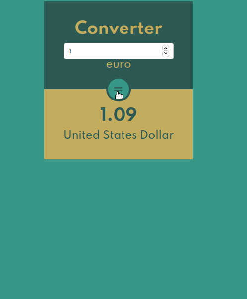

# Currencies-Converter React

Ceci est mon premier projet en React ! Il s'agit d'un convertisseur de devises. L'application convertit 1 euro en devise étrangère choisie.




## Coded with

- React
- SCSS

# Launch

## Prerequisite

1. Install Yarn : [Doc](https://yarnpkg.com/getting-started/install)
2. Download or clone this repository.

## Installation

Launch Yarn command to install dependencies :

```bash
yarn
```

Then use yarn start to launch the app :

```bash
yarn start
```

The app should be launched in your browser, Enjoy !
